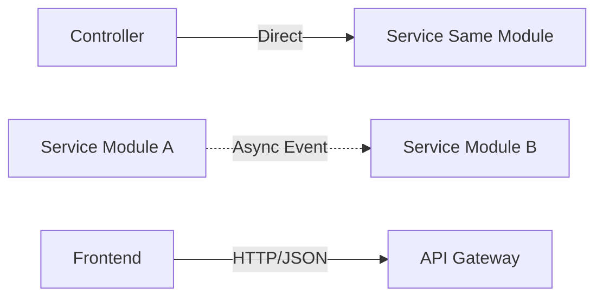

# AI Knowledge Base - FitnessApp

## 📋 Contexte Général de l'Application

### Objectif

FitnessApp est une application de fitness complète qui permet aux utilisateurs de :

- Créer et suivre des entraînements personnalisés
- Accéder à une bibliothèque d'exercices avec contenus multimédia
- Tracker leurs performances et progression
- Bénéficier de recommandations intelligentes via un coach IA
- Gérer des objectifs fitness personnalisés

### Domaine Métier

- **Fitness et bien-être personnel**
- **Coaching intelligent automatisé**
- **Gestion de contenus multimédia (exercices)**
- **Tracking et analytics des performances**
- **Monétisation freemium/premium**

### Utilisateurs Cibles

- **Débutants** : Onboarding guidé, programmes simples
- **Intermédiaires** : Personnalisation avancée, tracking détaillé
- **Avancés** : Analytics poussées, programmes complexes
- **Coaches/Admins** : Gestion de contenus, modération

---

## 🏗️ Architecture et Décisions Techniques

### Stack Technologique Principal

```
Backend: .NET 9 + ASP.NET Core Web API
Database: PostgreSQL avec EF Core
Architecture: Clean Architecture + DDD + Modular Monolith
Authentication: JWT avec refresh tokens
Testing: xUnit + AwesomeAssertions + Testcontainers
File Storage: MinIO/Azure Blob (média exercices)
```

### Architecture Modulaire (12 Modules)

```
🔐 Authentication - JWT, sécurité, tokens
👤 Users - Profils, préférences, abonnements
🏋️ Workouts - Séances d'entraînement structurées
💪 Exercises - Bibliothèque de mouvements avec média
📊 Tracking - Historique, métriques, performances
📅 Programs - Plans d'entraînement long terme
🤖 Coach - IA de recommandations personnalisées
🎯 Objectives - Gestion d'objectifs SMART
🔔 Notifications - Rappels et engagement
💳 Payments - Monétisation, abonnements
🎬 Content - Gestion des médias (vidéos/images)
🛡️ API - Orchestration, médiation, sécurité
```

### Choix d'Architecture Clés

- **Modular Monolith** : Modules autonomes mais déployés ensemble
- **Clean Architecture** : Séparation Domain/Application/Infrastructure par module
- **Database-per-Module** : Schémas PostgreSQL séparés (users., workouts., auth., etc.)
- **API-First** : Communication inter-modules via API/médiateur
- **Event-Driven** : Communication asynchrone via MediatR pour découplage

### Patterns de Communication



---

## ✨ Fonctionnalités Existantes

### Module Authentication

- **JWT Authentication** avec refresh tokens
- **Role-based authorization** (User/Admin)
- **Email confirmation** et 2FA (préparé)
- **Password hashing** sécurisé (Argon2)

**Endpoints disponibles:**

- `POST /api/v1/auth/register` - Inscription
- `POST /api/v1/auth/login` - Connexion
- `POST /api/v1/auth/refresh` - Refresh token
- `POST /api/v1/auth/logout` - Déconnexion
- `GET /api/v1/auth/me` - Profil utilisateur connecté

**Tests d'intégration HTTP (27/28 passent):**

```csharp
// Exemples de tests créés
[Fact] public async Task Register_WithValidData_ShouldReturnSuccess()
[Fact] public async Task Register_WithDuplicateEmail_ShouldReturnConflict()
[Fact] public async Task Register_WithDuplicateUserName_ShouldReturnConflict()
[Fact] public async Task Register_WithInvalidEmail_ShouldReturnBadRequest()
[Fact] public async Task Register_WithMismatchedPasswords_ShouldReturnBadRequest()
[Fact] public async Task Login_WithValidCredentials_ShouldReturnSuccess()
[Fact] public async Task Login_WithInvalidPassword_ShouldReturnUnauthorized()
[Fact] public async Task RefreshToken_WithValidToken_ShouldReturnNewTokens()
[Fact] public async Task RefreshToken_WithInvalidToken_ShouldReturnUnauthorized()
[Fact] public async Task RefreshToken_WithUsedToken_ShouldReturnUnauthorized() // ❌ FAILS
[Fact] public async Task GetAuthUser_WithValidToken_ShouldReturnUserInfo()
[Fact] public async Task Logout_WithValidSession_ShouldRevokeTokens()
[Fact] public async Task CompleteAuthFlow_ShouldWorkEndToEnd()
```

**Détails techniques des tests:**

- Validation stricte des mots de passe (12+ chars, pas de séquences comme "123")
- Tests avec JSON raw strings authentiques
- Gestion complète des refresh tokens avec rotation
- Tests de sécurité : tokens invalides, doublons, etc.
- Pipeline complet HTTP → Controller → Service → Repository

### Module Users

- **Profils complets** (âge, sexe, taille, poids, niveau fitness)
- **Préférences personnalisables** (durée entraînement, matériel, etc.)
- **Système d'abonnements** (freemium/premium)
- **RGPD compliance** (export, suppression données)

**Endpoints disponibles:**

- `GET/PUT /api/v1/users/profile` - Gestion profil
- `GET/PUT /api/v1/users/preferences` - Préférences
- `GET /api/v1/users/subscription` - Statut abonnement

### Module Exercises

- **Bibliothèque d'exercices** avec métadonnées complètes
- **Groupes musculaires** et **équipements requis**
- **Contenus multimédia** (images/vidéos via Content module)
- **Catégorisation** par type et difficulté

**Endpoints disponibles:**

- `GET /api/v1/exercises` - Liste paginée avec filtres
- `GET /api/v1/exercises/{id}` - Détail exercice
- `POST /api/v1/exercises` - Création (admin)
- `GET /api/v1/exercises/search` - Recherche textuelle

### Module Workouts

- **Workouts structurés** en phases (échauffement, effort, récupération)
- **Templates publics** (gérés par admins) vs **Workouts utilisateur**
- **Types multiples** : Template, UserCreated, AIGenerated
- **Gestion complète** : CRUD avec permissions

**Endpoints disponibles:**

- `GET /api/v1/workouts/templates` - Templates publics
- `POST /api/v1/workouts/templates` - Création template (admin)
- `GET/POST /api/v1/workouts/my-workouts` - Workouts personnels
- `GET /api/v1/workouts/search` - Recherche
- `GET /api/v1/workouts/category/{category}` - Filtrage

### Module Content

- **Gestion centralisée** des médias (images, vidéos)
- **Upload et stockage** via MinIO/Azure
- **Transcodage vidéo** et optimisation
- **Liaison exercices ↔ médias**

### Architecture de Tests

- **Tests d'intégration HTTP complets** avec TestContainers
- **Simulation utilisateur authentique** (JSON strings, pas d'objets C#)
- **Base de données isolée** par test via PostgreSQL container
- **Authentification complète** dans les tests (Admin/User)

### Status des Tests par Module

#### ✅ Module Users - COMPLET

- **18/18 tests intégration HTTP** ✅ (UserProfile endpoints)
- Couverture complète : CRUD + recherche + analytics

#### ✅ Module Exercises - COMPLET

- **14/14 tests intégration HTTP** ✅ (Bibliothèque d'exercices)
- Authentification Admin pour création/modification

#### ✅ Module Workouts - COMPLET

- **16/16 tests intégration HTTP** ✅ (Sessions d'entraînement)
- Tests complets CRUD + logique métier

#### 🔄 Module Authentication - EN COURS

- **27/28 tests intégration HTTP** ✅ (96% réussite)
- Tests complets : register, login, refresh, logout, validation
- 1 test échoue : `RefreshToken_WithUsedToken_ShouldReturnUnauthorized` (problème de révocation token concurrent)

---

## 🚀 Prompts Importants Utilisés

### 1. Transformation Tests d'Intégration

**Contexte :** Transformer les tests DbContext vers HTTP client authentique

**Prompt utilisé :**

```
"Transforme ces tests d'intégration pour qu'ils utilisent HTTP client au lieu de DbContext direct,
avec des JSON strings comme un vrai utilisateur enverrait, pas des objets C# typés"
```

**Résultat obtenu :**

- ✅ Tests HTTP avec authentification complète (14 tests exercises + 16 tests workouts)
- ✅ JSON raw strings au lieu d'enums/objets C#
- ✅ Pipeline complet Controller → Service → Repository → Database
- ✅ Pattern réutilisable pour tous les modules

**Code exemple généré :**

```csharp
// Au lieu de :
var createDto = new CreateExerciseDto { Type = ExerciseType.Strength };

// Maintenant :
var createRequestJson = """
{
    "name": "Push-ups",
    "type": "Strength",
    "muscleGroups": "Chest"
}
""";
```

### 2. Architecture Modulaire Clean

**Contexte :** Structurer une application fitness complexe

**Prompt utilisé :**

```
"Crée une architecture modulaire clean avec séparation des responsabilités pour une app fitness,
en utilisant Domain-Driven Design avec modules autonomes"
```

**Résultat obtenu :**

- ✅ 12 modules métier spécialisés
- ✅ Clean Architecture par module (Domain/Application/Infrastructure)
- ✅ Schémas PostgreSQL séparés
- ✅ Communication découplée via événements

### 3. Système d'Authentification Robuste

**Contexte :** Sécurité et gestion des utilisateurs

**Prompt utilisé :**

```
"Implémente un système d'authentification JWT avec refresh tokens,
roles-based authorization et séparation Auth/Users modules"
```

**Résultat obtenu :**

- ✅ Module Authentication dédié (tokens, sécurité)
- ✅ Module Users séparé (profils, données métier)
- ✅ JWT + refresh tokens avec rotation
- ✅ Authorization policies réutilisables

---

## 📈 Fonctionnalités en Cours et Roadmap

### 🔄 En Développement

- [ ] **Module Coach** - Recommandations IA basées sur performances
- [ ] **Module Programs** - Plans d'entraînement multi-semaines
- [ ] **Module Tracking** - Analytics avancées et métriques
- [ ] **Module Objectives** - Gestion objectifs SMART avec progression

### 🎯 Priorité Haute (Next Sprint)

- [ ] **Tests d'intégration modules restants** (Users, Content, Auth)
- [ ] **Cross-module integration tests** (workflow complets utilisateur)
- [ ] **API documentation** Swagger complète avec exemples
- [ ] **Seed data** pour développement et démos

### 🚀 Roadmap Moyen Terme

- [ ] **Performance optimizations** (caching Redis, pagination)
- [ ] **Notifications push** et système d'engagement
- [ ] **Système de payments** Stripe/PayPal
- [ ] **Analytics dashboard** pour admins
- [ ] **Mobile app** React Native/Flutter
- [ ] **Déploiement cloud** Azure/AWS avec CI/CD

### 💡 Idées et Améliorations

- [ ] **Workouts en temps réel** avec WebSockets
- [ ] **IA conversationnelle** pour coaching personnalisé
- [ ] **Social features** (partage workouts, défis)
- [ ] **Marketplace exercices** communautaire
- [ ] **Intégrations wearables** (Apple Health, Garmin)

---

## 🧪 Testing Strategy et Patterns

### Architecture des Tests Validée

```
Integration Tests (HTTP Client + TestContainers)
├── Authentication Flow Tests ✅
├── Exercise CRUD Tests ✅ (14 tests passing)
├── Workout Management Tests ✅ (16 tests passing)
├── User Journey Tests (planned)
└── Cross-Module Tests (planned)

Unit Tests
├── Domain Logic Tests
├── Value Objects Tests
├── Service Layer Tests
└── Validation Tests
```

### Pattern de Test HTTP Authentique

```csharp
[Fact]
public async Task CreateWorkout_WithValidData_ShouldCreate()
{
    // Arrange - Authentification réaliste
    await AuthenticateAsAdminAsync();

    // Act - JSON string comme vrai utilisateur
    var jsonRequest = """{"name": "HIIT", "type": "Template"}""";
    var response = await Client.PostAsync("/api/v1/workouts/templates",
        new StringContent(jsonRequest, UTF8, "application/json"));

    // Assert - Validation HTTP complète
    response.StatusCode.Should().Be(HttpStatusCode.Created);
    var content = await response.Content.ReadAsStringAsync();
    content.Should().Contain("\"name\":\"HIIT\"");
}
```

---

## 💾 Base de Données et Modèles

### Structure PostgreSQL par Module

```sql
-- Schémas séparés par domaine métier
auth.AuthUsers, auth.RefreshTokens
users.UserProfiles, users.Preferences, users.Subscriptions
exercises.Exercises
workouts.Workouts, workouts.WorkoutPhases, workouts.WorkoutExercises
content.MediaAssets, content.exercise_media_assets
tracking.WorkoutSessions, tracking.ExerciseSets, tracking.UserMetrics
```

### Relations Cross-Module Clés

```
Users ←→ Workouts (créateur/propriétaire)
Workouts ←→ Exercises (via WorkoutExercises)
Exercises ←→ MediaAssets (images/vidéos)
Users ←→ WorkoutSessions (via Tracking)
```

---

## 🔧 Configuration et Environnement

### Environnements

- **Development** : Base locale + TestContainers pour tests
- **Testing** : Pipeline CI avec PostgreSQL service
- **Production** : Azure/AWS (prévu)

### Configuration Clés

```json
{
  "ConnectionStrings": {
    "DefaultConnection": "PostgreSQL connection"
  },
  "JwtSettings": {
    "SecretKey": "...",
    "ExpiryMinutes": 15,
    "RefreshTokenExpiryDays": 30
  },
  "ContentSettings": {
    "StorageType": "MinIO",
    "MaxFileSize": "50MB"
  }
}
```

---

## 📝 Notes pour Futurs Chats

### Context Important à Rappeler

1. **Architecture modulaire stricte** - Pas de couplage direct entre modules
2. **Tests HTTP authentiques** - Toujours simuler vrais utilisateurs avec JSON
3. **Clean Architecture** - Respecter les couches Domain/Application/Infrastructure
4. **PostgreSQL schémas** - Chaque module a son schéma dédié
5. **JWT + Refresh tokens** - Sécurité robuste avec rotation

### Commandes Utiles

```bash
# Tests d'intégration spécifiques
dotnet test --filter "FullyQualifiedName~ExerciseIntegrationTests"
dotnet test --filter "FullyQualifiedName~WorkoutIntegrationTests"

# Migrations par module
dotnet ef migrations add --context ExercisesDbContext
dotnet ef database update --context WorkoutsDbContext

# Lancer l'API avec hot reload
dotnet watch run --project src/FitnessApp.API
```

### Anti-Patterns à Éviter

- ❌ Couplage direct entre modules (utiliser médiation)
- ❌ Tests avec objets C# typés (utiliser JSON strings)
- ❌ Logique métier dans les controllers
- ❌ Accès direct à la BDD depuis d'autres modules
- ❌ Dépendances circulaires entre domaines

### Patterns Validés à Réutiliser

- ✅ HTTP Client integration tests avec TestContainers
- ✅ Module registration via extension methods
- ✅ JWT + Refresh token avec policies
- ✅ Repository pattern avec EF Core
- ✅ MediatR pour communication inter-modules

---

_Dernière mise à jour : Septembre 2025_
_Version : v1.0 - Base architecture validée avec tests intégration_
