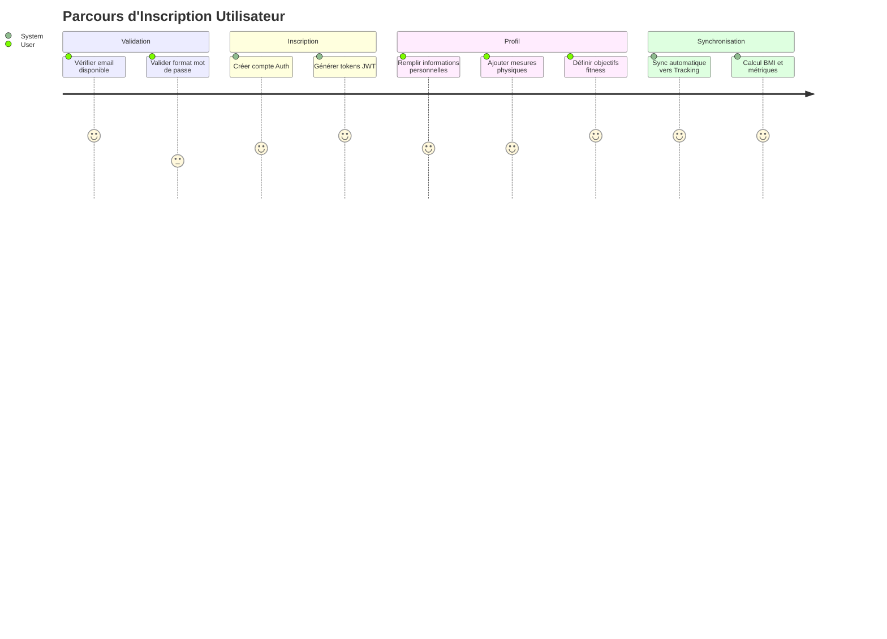
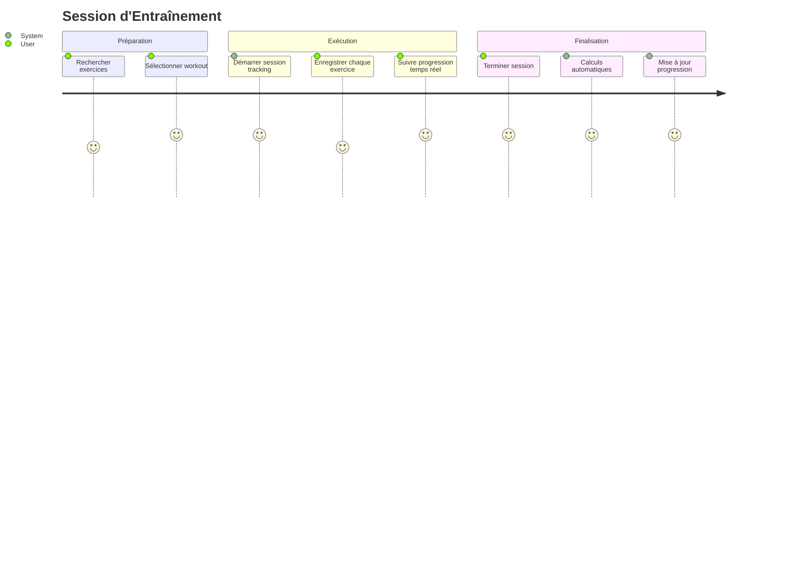
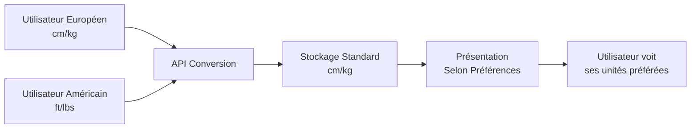

# Documentation Complète - FitnessApp Architecture & Testing

## 📚 Table des Matières

1. [Architecture Globale](#architecture-globale)
2. [Parcours Utilisateurs](#parcours-utilisateurs)
3. [Architecture Technique](#architecture-technique)
4. [Guide des Tests d'Intégration](#guide-des-tests-dintégration)
5. [Points Clés pour les Tests](#points-clés-pour-les-tests)

## 🏗️ Architecture Globale

### Vue d'Ensemble des Modules

FitnessApp suit une **architecture modulaire** avec **12 modules principaux** :

```
┌─────────────┬──────────────────────────────────────────────────┐
│ Module      │ Responsabilité Principale                        │
├─────────────┼──────────────────────────────────────────────────┤
│ API         │ Point d'entrée, orchestration, médiation        │
│ Auth        │ Authentification, sécurité, tokens              │
│ Users       │ Profils utilisateurs, préférences, abonnements  │
│ Workouts    │ Définition des séances d'entraînement           │
│ Exercises   │ Bibliothèque d'exercices et mouvements          │
│ Tracking    │ Historique, métriques, sessions                 │
│ Programs    │ Plans d'entraînement à long terme               │
│ Coach       │ Analytics, recommandations intelligentes        │
│ Content     │ Gestion des médias (images, vidéos)             │
│ Objectives  │ Objectifs personnalisés et suivi                │
│ Payments    │ Abonnements et monétisation                     │
│ Notifications│ Engagement et rappels utilisateur              │
└─────────────┴──────────────────────────────────────────────────┘
```

### Patterns Architecturaux

- **Domain-Driven Design (DDD)** : Modules alignés sur les domaines métier
- **Clean Architecture** : Séparation Domain/Application/Infrastructure
- **CQRS léger** : Séparation lecture/écriture dans les services
- **Event-Driven** : Communication asynchrone entre modules
- **API First** : Contrats clairs entre modules via l'API

## 🚀 Parcours Utilisateurs Critiques

### 1. Parcours d'Inscription Complète



**Modules impliqués** : API → Auth → Users → Tracking  
**Temps total attendu** : < 2 minutes  
**Points de validation** : Tokens valides, Profil complet, Métriques synchronisées

### 2. Session d'Entraînement Complète



**Modules impliqués** : API → Exercises → Workouts → Tracking → Coach → Users  
**Durée session** : 30-90 minutes  
**Points de validation** : Session cohérente, Stats calculées, Progression mise à jour

### 3. Gestion Multi-Unités



**Conversion supportée** :

- **Hauteur** : cm ↔ ft ↔ in
- **Poids** : kg ↔ lbs
- **Stockage** : Toujours en unités standard (cm/kg)
- **Affichage** : Selon préférences utilisateur

## 🔧 Architecture Technique Détaillée

### Stack Technologique

```
Frontend (Non couvert dans cette doc)
├── Mobile: React Native / Flutter
└── Web: React.js / Angular

Backend (.NET 9)
├── API Layer: ASP.NET Core Web API
├── Application Layer: Services métier
├── Domain Layer: Entités & Value Objects
└── Infrastructure Layer: EF Core, PostgreSQL

Infrastructure
├── Database: PostgreSQL
├── Cache: Redis (optionnel)
├── Storage: Azure Blob Storage
└── Monitoring: Application Insights
```

### Patterns de Communication

1. **Synchrone** : Controller → Service direct (même module)
2. **Asynchrone** : Fire-and-forget via Mediator (cross-module)
3. **Event-Driven** : Notifications et analytics (futur)

### Exemple : Synchronisation Users → Tracking

```csharp
// Fire-and-forget pattern
[HttpPatch("profile/measurements")]
public async Task<IActionResult> UpdateMeasurements(UpdateRequest request)
{
    // 1. Update profile (synchrone, critique)
    var profile = await _userService.UpdateAsync(request);

    // 2. Sync vers tracking (asynchrone, non-critique)
    _ = Task.Run(async () => await _syncMediator.ProcessSync(profile));

    // 3. Retour immédiat à l'utilisateur
    return Ok(profile);
}
```

## 🧪 Guide des Tests d'Intégration

### Stratégie de Tests

```mermaid
pyramid
    title Pyramide des Tests
    E2E["E2E Tests<br/>(Peu nombreux)<br/>Parcours critiques"]
    Integration["Integration Tests<br/>(Moyennement nombreux)<br/>Interactions modules"]
    Unit["Unit Tests<br/>(Très nombreux)<br/>Logique métier"]
```

### Priorités des Tests d'Intégration

#### 🔥 **Critiques (P0)**

- Cycle complet authentification
- Création profil + synchronisation métrique
- Session workout complète
- Conversion d'unités cross-module

#### ⚡ **Importantes (P1)**

- Gestion des rôles et permissions
- Mise à jour profil avec sync
- Robustesse (échecs partiels)
- Performance sous charge modérée

#### 📋 **Utiles (P2)**

- Concurrence et race conditions
- Long-running sessions
- Analytics et coaching
- Migration de données

### Template de Test d'Intégration

```csharp
[TestFixture]
public class UserJourneyIntegrationTests : IntegrationTestBase
{
    [Test]
    public async Task CompleteUserJourney_ShouldWorkEndToEnd()
    {
        // 🎯 ARRANGE - Setup test data
        var testUser = TestDataBuilder.CreateUser()
            .WithEmail("test@example.com")
            .WithRole(Role.Athlete)
            .Build();

        // 🚀 ACT & ASSERT - Step by step validation

        // Step 1: Registration
        var authResponse = await RegisterUserAsync(testUser);
        authResponse.Should().BeSuccessful();
        authResponse.AccessToken.Should().BeValidJWT();

        // Step 2: Profile Creation
        SetAuthToken(authResponse.AccessToken);
        var profileResponse = await CreateProfileAsync(testUser);
        profileResponse.Should().BeSuccessful();

        // Step 3: Cross-Module Validation
        await AssertMetricsSyncedAsync(testUser.UserId);

        // Step 4: Business Logic Validation
        var profile = await GetProfileAsync();
        profile.BMI.Should().BeCalculatedCorrectly();

        // 📊 VERIFY - Final state consistency
        await AssertSystemConsistencyAsync(testUser);
    }

    private async Task AssertMetricsSyncedAsync(Guid userId)
    {
        // Allow async processing
        await Task.Delay(TimeSpan.FromSeconds(1));

        var metrics = await GetUserMetricsAsync();
        metrics.Should().ContainWeight().And.ContainHeight();
    }
}
```

## 🎯 Points Clés pour les Tests

### 1. **Cohérence des Données Cross-Module**

```csharp
// Vérifier que les données sont cohérentes entre modules
var userProfile = await GetAsync<UserProfile>("/api/v1/users/profile");
var trackingMetrics = await GetAsync<List<Metric>>("/api/v1/tracking/metrics");

// Weight doit être identique dans les deux modules
var profileWeight = userProfile.PhysicalMeasurements.WeightKg;
var latestWeightMetric = trackingMetrics.GetLatest(UserMetricType.Weight);
latestWeightMetric.Value.Should().Be(profileWeight);
```

### 2. **Conversion d'Unités Précise**

```csharp
// Test avec unités impériales
var imperialUpdate = new UpdateMeasurementsRequest
{
    Height = 5.9m, // feet
    Weight = 165m, // lbs
    Units = new Units { HeightUnit = "ft", WeightUnit = "lbs" }
};

await UpdateProfileAsync(imperialUpdate);

var profile = await GetProfileAsync();
profile.PhysicalMeasurements.HeightCm.Should().BeApproximately(179.8m, 0.1m);
profile.PhysicalMeasurements.WeightKg.Should().BeApproximately(74.8m, 0.1m);
```

### 3. **Robustesse et Résilience**

```csharp
// Test avec service temporairement indisponible
_mockTrackingService.Setup(x => x.RecordMetricAsync(It.IsAny<UserMetric>()))
                   .ThrowsAsync(new ServiceUnavailableException());

// L'update de profil doit réussir malgré l'échec de sync
var response = await UpdateProfileAsync(request);
response.Should().HaveStatusCode(HttpStatusCode.OK);

// La sync doit être réessayée plus tard (vérifier logs)
_logger.Received().LogWarning("Sync failed, will retry later");
```

### 4. **Performance et Scalabilité**

```csharp
[Test]
public async Task MultipleUsers_ShouldMaintainPerformance()
{
    var users = await CreateMultipleUsersAsync(count: 100);
    var stopwatch = Stopwatch.StartNew();

    var tasks = users.Select(async user =>
    {
        SetAuthToken(user.AccessToken);
        return await GetAsync("/api/v1/users/profile");
    });

    var responses = await Task.WhenAll(tasks);
    stopwatch.Stop();

    // Tous les appels doivent réussir
    responses.Should().AllSatisfy(r => r.IsSuccessStatusCode.Should().BeTrue());

    // Performance acceptable
    var avgResponseTime = stopwatch.ElapsedMilliseconds / (double)users.Count;
    avgResponseTime.Should().BeLessThan(200); // < 200ms par appel
}
```

### 5. **Sécurité et Autorisation**

```csharp
[TestCase(Role.Athlete, "/api/v1/admin/users", HttpStatusCode.Forbidden)]
[TestCase(Role.Coach, "/api/v1/admin/analytics", HttpStatusCode.OK)]
[TestCase(Role.Admin, "/api/v1/admin/users", HttpStatusCode.OK)]
public async Task Authorization_ShouldEnforceRoleAccess(Role role, string endpoint, HttpStatusCode expected)
{
    var user = await CreateUserWithRoleAsync(role);
    SetAuthToken(user.AccessToken);

    var response = await GetAsync(endpoint);
    response.StatusCode.Should().Be(expected);
}
```

## 📊 Métriques de Succès

### Métriques Techniques

| Métrique                         | Cible       | Critique |
| -------------------------------- | ----------- | -------- |
| **Temps de réponse API**         | P95 < 500ms | P99 < 1s |
| **Taux de succès**               | > 99.5%     | > 99%    |
| **Couverture tests intégration** | > 80%       | > 60%    |
| **Temps de build**               | < 5 min     | < 10 min |

### Métriques Fonctionnelles

| Scénario                 | Taux de succès | Temps max |
| ------------------------ | -------------- | --------- |
| **Inscription complète** | > 98%          | < 2 min   |
| **Login**                | > 99.5%        | < 5s      |
| **Création profil**      | > 95%          | < 30s     |
| **Session workout**      | > 90%          | Variable  |
| **Sync cross-module**    | > 95%          | < 10s     |

## 🚀 Prochaines Étapes

### Implémentation des Tests

1. **Semaine 1** : Tests d'authentification complets
2. **Semaine 2** : Tests de parcours utilisateur (inscription + profil)
3. **Semaine 3** : Tests cross-module et synchronisation
4. **Semaine 4** : Tests de robustesse et performance

### Infrastructure de Tests

- **Base de données de test** : Container PostgreSQL dédié
- **Mocks intelligents** : Services externes mockés
- **Data builders** : Génération de données de test cohérentes
- **Assertions personnalisées** : Validations métier spécifiques

### Monitoring et Observabilité

- **Logs structurés** : Traçabilité des flux cross-module
- **Métriques métier** : Taux de succès des parcours
- **Health checks** : Vérification continue de l'intégrité
- **Alerting** : Notification en cas de dégradation

Cette documentation complète fournit tous les éléments nécessaires pour comprendre l'architecture de FitnessApp et implémenter des tests d'intégration robustes et pertinents. Les diagrammes et exemples de code facilitent la compréhension des flux complexes et des interactions entre modules.
