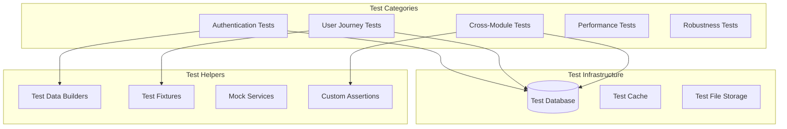

# Guide des Tests d'Intégration - FitnessApp

## 🎯 Stratégie des Tests d'Intégration

### Objectifs des Tests d'Intégration

1. **Validation des flux cross-module** : Vérifier que les modules communiquent correctement
2. **Cohérence des données** : S'assurer de l'intégrité lors des synchronisations
3. **Validation de la sécurité** : Tester l'authentification et l'autorisation end-to-end
4. **Performance sous charge** : Valider les temps de réponse avec des données réelles
5. **Robustesse** : Tester le comportement en cas d'erreurs partielles

## 🏗️ Architecture des Tests

### Structure des Tests d'Intégration



## 🔐 Tests d'Authentification et Autorisation

### Scénario : Cycle Complet d'Authentification

```csharp
[Test]
public async Task CompleteAuthenticationFlow_ShouldWorkEndToEnd()
{
    // Arrange
    var testEmail = "testuser@example.com";
    var testPassword = "SecureP@ssw0rd123";

    // Act & Assert - Registration
    var registerRequest = new RegisterRequest(testEmail, "testuser", testPassword, testPassword);
    var registerResponse = await _client.PostAsJsonAsync("/api/v1/auth/register", registerRequest);
    registerResponse.Should().HaveStatusCode(HttpStatusCode.Created);

    var authResponse = await registerResponse.Content.ReadFromJsonAsync<AuthResponse>();
    authResponse.AccessToken.Should().NotBeNullOrEmpty();
    authResponse.RefreshToken.Should().NotBeNullOrEmpty();

    // Act & Assert - Token Validation
    _client.DefaultRequestHeaders.Authorization =
        new AuthenticationHeaderValue("Bearer", authResponse.AccessToken);

    var protectedResponse = await _client.GetAsync("/api/v1/auth/me");
    protectedResponse.Should().HaveStatusCode(HttpStatusCode.OK);

    // Act & Assert - Token Refresh
    var refreshRequest = new RefreshTokenRequest(authResponse.RefreshToken);
    var refreshResponse = await _client.PostAsJsonAsync("/api/v1/auth/refresh", refreshRequest);
    refreshResponse.Should().HaveStatusCode(HttpStatusCode.OK);

    var newTokens = await refreshResponse.Content.ReadFromJsonAsync<AuthResponse>();
    newTokens.AccessToken.Should().NotBe(authResponse.AccessToken);

    // Act & Assert - Logout
    var logoutResponse = await _client.PostAsync("/api/v1/auth/logout", null);
    logoutResponse.Should().HaveStatusCode(HttpStatusCode.OK);

    // Verify token is revoked
    var revokedResponse = await _client.GetAsync("/api/v1/auth/me");
    revokedResponse.Should().HaveStatusCode(HttpStatusCode.Unauthorized);
}
```

### Scénario : Test des Politiques d'Autorisation

```csharp
[Test]
public async Task AuthorizationPolicies_ShouldEnforceCorrectRoles()
{
    // Arrange - Create users with different roles
    var regularUser = await CreateAuthenticatedUserAsync(Role.Athlete);
    var coachUser = await CreateAuthenticatedUserAsync(Role.Coach);
    var adminUser = await CreateAuthenticatedUserAsync(Role.Admin);

    // Test regular user access
    SetAuthToken(regularUser.AccessToken);
    var userProfileResponse = await _client.GetAsync("/api/v1/users/profile");
    userProfileResponse.Should().HaveStatusCode(HttpStatusCode.OK);

    var adminOnlyResponse = await _client.PostAsync("/api/v1/workouts/admin", null);
    adminOnlyResponse.Should().HaveStatusCode(HttpStatusCode.Forbidden);

    // Test coach access
    SetAuthToken(coachUser.AccessToken);
    var coachWorkoutResponse = await _client.GetAsync("/api/v1/workouts/coach/analytics");
    coachWorkoutResponse.Should().HaveStatusCode(HttpStatusCode.OK);

    // Test admin access
    SetAuthToken(adminUser.AccessToken);
    var adminResponse = await _client.PostAsync("/api/v1/workouts/admin", new StringContent("{}"));
    adminResponse.Should().HaveStatusCode(HttpStatusCode.OK);
}
```

## 👤 Tests de Parcours Utilisateur

### Scénario : Inscription et Profil Complet

```csharp
[Test]
public async Task CompleteUserRegistrationJourney_ShouldCreateProfileAndSyncMetrics()
{
    // Step 1: Register user
    var authResponse = await RegisterNewUserAsync();
    SetAuthToken(authResponse.AccessToken);

    // Step 2: Create profile with measurements
    var profileRequest = new CreateUserProfileRequest
    {
        FirstName = "John",
        LastName = "Doe",
        DateOfBirth = new DateTime(1990, 5, 15),
        Gender = Gender.Male,
        HeightCm = 180m,
        WeightKg = 75m,
        FitnessLevel = FitnessLevel.Intermediate,
        PrimaryFitnessGoal = FitnessGoal.MUSCLE_GAIN
    };

    var profileResponse = await _client.PostAsJsonAsync("/api/v1/users/profile", profileRequest);
    profileResponse.Should().HaveStatusCode(HttpStatusCode.Created);

    var createdProfile = await profileResponse.Content.ReadFromJsonAsync<UserProfileResponse>();
    createdProfile.PhysicalMeasurements.BMI.Should().BeApproximately(23.15m, 0.1m);

    // Step 3: Verify metrics were synced to tracking module
    await Task.Delay(1000); // Allow async sync to complete

    var metricsResponse = await _client.GetAsync("/api/v1/tracking/metrics");
    metricsResponse.Should().HaveStatusCode(HttpStatusCode.OK);

    var metrics = await metricsResponse.Content.ReadFromJsonAsync<List<UserMetricDto>>();
    metrics.Should().Contain(m => m.MetricType == UserMetricType.Weight && m.Value == 75m);
    metrics.Should().Contain(m => m.MetricType == UserMetricType.Height && m.Value == 180m);

    // Step 4: Update measurements with different units
    var updateRequest = new UpdatePhysicalMeasurementsRequest
    {
        Height = 5.9m, // feet
        Weight = 165m, // lbs
        Units = new MeasurementUnits { HeightUnit = "ft", WeightUnit = "lbs" }
    };

    var updateResponse = await _client.PatchAsJsonAsync("/api/v1/users/profile/measurements", updateRequest);
    updateResponse.Should().HaveStatusCode(HttpStatusCode.OK);

    // Verify conversion was applied correctly
    var updatedProfile = await updateResponse.Content.ReadFromJsonAsync<UserProfileResponse>();
    updatedProfile.PhysicalMeasurements.HeightCm.Should().BeApproximately(179.8m, 0.1m);
    updatedProfile.PhysicalMeasurements.WeightKg.Should().BeApproximately(74.8m, 0.1m);
}
```

### Scénario : Session d'Entraînement Complète

```csharp
[Test]
public async Task CompleteWorkoutSession_ShouldTrackAllExercisesAndCalculateStats()
{
    // Arrange - Setup authenticated user with profile
    var user = await CreateUserWithCompleteProfileAsync();
    SetAuthToken(user.AccessToken);

    // Get available workout
    var workoutsResponse = await _client.GetAsync("/api/v1/workouts/active");
    var workouts = await workoutsResponse.Content.ReadFromJsonAsync<List<WorkoutDto>>();
    var selectedWorkout = workouts.First();

    // Act - Start workout session
    var startRequest = new StartWorkoutSessionRequest { WorkoutId = selectedWorkout.Id };
    var sessionResponse = await _client.PostAsJsonAsync("/api/v1/tracking/sessions/start", startRequest);
    sessionResponse.Should().HaveStatusCode(HttpStatusCode.OK);

    var session = await sessionResponse.Content.ReadFromJsonAsync<WorkoutSessionDto>();
    session.Status.Should().Be(WorkoutSessionStatus.InProgress);

    // Act - Record exercises
    foreach (var phase in selectedWorkout.Phases)
    {
        foreach (var exercise in phase.Exercises)
        {
            var exerciseRequest = new AddExerciseToSessionRequest
            {
                ExerciseId = exercise.ExerciseId,
                Sets = new List<ExerciseSetRequest>
                {
                    new() { Reps = 12, Weight = 60m },
                    new() { Reps = 10, Weight = 65m },
                    new() { Reps = 8, Weight = 70m }
                }
            };

            var exerciseResponse = await _client.PostAsJsonAsync(
                $"/api/v1/tracking/sessions/{session.Id}/exercises",
                exerciseRequest);
            exerciseResponse.Should().HaveStatusCode(HttpStatusCode.OK);
        }
    }

    // Act - Complete session
    var completeResponse = await _client.PostAsync($"/api/v1/tracking/sessions/{session.Id}/complete", null);
    completeResponse.Should().HaveStatusCode(HttpStatusCode.OK);

    var completedSession = await completeResponse.Content.ReadFromJsonAsync<WorkoutSessionDto>();
    completedSession.Status.Should().Be(WorkoutSessionStatus.Completed);
    completedSession.Duration.Should().BeGreaterThan(TimeSpan.Zero);
    completedSession.TotalSets.Should().BeGreaterThan(0);

    // Assert - Verify analytics were triggered
    await Task.Delay(2000); // Allow analytics processing

    var statsResponse = await _client.GetAsync("/api/v1/tracking/stats");
    var stats = await statsResponse.Content.ReadFromJsonAsync<TrackingStatsDto>();
    stats.TotalWorkouts.Should().BeGreaterThan(0);
    stats.AverageWorkoutDuration.Should().BeGreaterThan(TimeSpan.Zero);
}
```

## 🔄 Tests Cross-Module

### Scénario : Synchronisation des Métriques

```csharp
[Test]
public async Task UserProfileUpdate_ShouldSyncMetricsToTrackingModule()
{
    // Arrange
    var user = await CreateAuthenticatedUserAsync();
    SetAuthToken(user.AccessToken);

    // Create initial profile
    var initialProfile = await CreateUserProfileAsync(user.UserId, heightCm: 175, weightKg: 70);

    // Act - Update measurements
    var updateRequest = new UpdatePhysicalMeasurementsRequest
    {
        Height = 176m,
        Weight = 72.5m
    };

    var updateResponse = await _client.PatchAsJsonAsync("/api/v1/users/profile/measurements", updateRequest);
    updateResponse.Should().HaveStatusCode(HttpStatusCode.OK);

    // Allow async sync to complete
    await Task.Delay(1000);

    // Assert - Verify sync in tracking module
    var metricsResponse = await _client.GetAsync("/api/v1/tracking/metrics");
    var metrics = await metricsResponse.Content.ReadFromJsonAsync<List<UserMetricDto>>();

    // Should have both initial and updated metrics
    var weightMetrics = metrics.Where(m => m.MetricType == UserMetricType.Weight).OrderBy(m => m.RecordedAt).ToList();
    weightMetrics.Should().HaveCount(2);
    weightMetrics[0].Value.Should().Be(70m); // Initial
    weightMetrics[1].Value.Should().Be(72.5m); // Updated

    var heightMetrics = metrics.Where(m => m.MetricType == UserMetricType.Height).OrderBy(m => m.RecordedAt).ToList();
    heightMetrics.Should().HaveCount(2);
    heightMetrics[0].Value.Should().Be(175m); // Initial
    heightMetrics[1].Value.Should().Be(176m); // Updated
}
```

### Scénario : Conversion d'Unités Cross-Module

```csharp
[Test]
public async Task UnitConversion_ShouldWorkConsistentlyAcrossModules()
{
    // Arrange
    var user = await CreateAuthenticatedUserAsync();
    SetAuthToken(user.AccessToken);

    // Test data in imperial units
    var heightFeet = 5.9m; // feet
    var weightLbs = 165m; // pounds

    // Expected conversions
    var expectedHeightCm = 179.8m;
    var expectedWeightKg = 74.8m;

    // Act - Update profile with imperial units
    var profileUpdate = new UpdatePhysicalMeasurementsRequest
    {
        Height = heightFeet,
        Weight = weightLbs,
        Units = new MeasurementUnits { HeightUnit = "ft", WeightUnit = "lbs" }
    };

    var profileResponse = await _client.PatchAsJsonAsync("/api/v1/users/profile/measurements", profileUpdate);
    profileResponse.Should().HaveStatusCode(HttpStatusCode.OK);

    var updatedProfile = await profileResponse.Content.ReadFromJsonAsync<UserProfileResponse>();

    // Assert - Profile stores converted values
    updatedProfile.PhysicalMeasurements.HeightCm.Should().BeApproximately(expectedHeightCm, 0.1m);
    updatedProfile.PhysicalMeasurements.WeightKg.Should().BeApproximately(expectedWeightKg, 0.1m);

    // Act - Record metric directly with imperial units
    var metricRequest = new RecordUserMetricRequest
    {
        MetricType = UserMetricType.Weight,
        Value = weightLbs,
        Unit = "lbs"
    };

    var metricResponse = await _client.PostAsJsonAsync("/api/v1/tracking/metrics", metricRequest);
    metricResponse.Should().HaveStatusCode(HttpStatusCode.OK);

    // Assert - Tracking module should store in standard units
    await Task.Delay(500);

    var metricsResponse = await _client.GetAsync("/api/v1/tracking/metrics");
    var metrics = await metricsResponse.Content.ReadFromJsonAsync<List<UserMetricDto>>();

    var directMetric = metrics.Where(m => m.MetricType == UserMetricType.Weight)
                             .OrderByDescending(m => m.RecordedAt)
                             .First();

    directMetric.Value.Should().BeApproximately(expectedWeightKg, 0.1m);
    directMetric.Unit.Should().Be("kg"); // Stored in standard unit
}
```

## 🔧 Tests de Robustesse

### Scénario : Gestion des Échecs Partiels

```csharp
[Test]
public async Task ProfileUpdateWithSyncFailure_ShouldUpdateProfileButLogSyncError()
{
    // Arrange - Mock tracking service to fail
    var user = await CreateAuthenticatedUserAsync();
    SetAuthToken(user.AccessToken);

    // Simulate tracking service unavailable
    _mockTrackingService.Setup(x => x.RecordUserMetricAsync(It.IsAny<Guid>(), It.IsAny<UserMetricType>(), It.IsAny<decimal>(), It.IsAny<string>(), It.IsAny<CancellationToken>()))
                       .ThrowsAsync(new HttpRequestException("Tracking service unavailable"));

    // Act - Update profile
    var updateRequest = new UpdatePhysicalMeasurementsRequest
    {
        Height = 180m,
        Weight = 75m
    };

    var response = await _client.PatchAsJsonAsync("/api/v1/users/profile/measurements", updateRequest);

    // Assert - Profile update should succeed despite sync failure
    response.Should().HaveStatusCode(HttpStatusCode.OK);

    var updatedProfile = await response.Content.ReadFromJsonAsync<UserProfileResponse>();
    updatedProfile.PhysicalMeasurements.HeightCm.Should().Be(180m);
    updatedProfile.PhysicalMeasurements.WeightKg.Should().Be(75m);

    // Verify error was logged (check logs or error tracking)
    // In a real scenario, you'd check your logging/monitoring system
}
```

### Scénario : Test de Concurrence

```csharp
[Test]
public async Task ConcurrentProfileUpdates_ShouldHandleRaceConditions()
{
    // Arrange
    var user = await CreateAuthenticatedUserAsync();
    var client1 = CreateClientWithAuth(user.AccessToken);
    var client2 = CreateClientWithAuth(user.AccessToken);

    // Act - Concurrent updates
    var update1 = new UpdatePhysicalMeasurementsRequest { Weight = 75m };
    var update2 = new UpdatePhysicalMeasurementsRequest { Weight = 76m };

    var task1 = client1.PatchAsJsonAsync("/api/v1/users/profile/measurements", update1);
    var task2 = client2.PatchAsJsonAsync("/api/v1/users/profile/measurements", update2);

    var responses = await Task.WhenAll(task1, task2);

    // Assert - At least one should succeed
    responses.Should().Contain(r => r.IsSuccessStatusCode);

    // Verify final state is consistent
    var finalResponse = await client1.GetAsync("/api/v1/users/profile");
    finalResponse.Should().HaveStatusCode(HttpStatusCode.OK);

    var finalProfile = await finalResponse.Content.ReadFromJsonAsync<UserProfileResponse>();
    finalProfile.PhysicalMeasurements.WeightKg.Should().BeOneOf(75m, 76m);
}
```

## 📊 Tests de Performance

### Scénario : Performance sous Charge

```csharp
[Test]
public async Task HighVolumeRequests_ShouldMaintainPerformance()
{
    // Arrange
    var users = await CreateMultipleUsersAsync(50);
    var stopwatch = Stopwatch.StartNew();
    var successfulRequests = 0;
    var tasks = new List<Task>();

    // Act - Simulate concurrent load
    foreach (var user in users)
    {
        tasks.Add(Task.Run(async () =>
        {
            try
            {
                var client = CreateClientWithAuth(user.AccessToken);
                var response = await client.GetAsync("/api/v1/users/profile");

                if (response.IsSuccessStatusCode)
                {
                    Interlocked.Increment(ref successfulRequests);
                }
            }
            catch (Exception ex)
            {
                // Log exception but don't fail test
                Console.WriteLine($"Request failed: {ex.Message}");
            }
        }));
    }

    await Task.WhenAll(tasks);
    stopwatch.Stop();

    // Assert - Performance requirements
    var averageResponseTime = stopwatch.ElapsedMilliseconds / (double)users.Count;
    averageResponseTime.Should().BeLessThan(500); // < 500ms average

    var successRate = successfulRequests / (double)users.Count;
    successRate.Should().BeGreaterThan(0.95); // > 95% success rate
}
```

## 🛠️ Helpers et Utilitaires de Test

### Test Data Builders

```csharp
public class TestDataBuilder
{
    private readonly HttpClient _client;

    public async Task<AuthResponse> CreateAuthenticatedUserAsync(
        Role role = Role.Athlete,
        string email = null,
        string username = null)
    {
        email ??= $"test.{Guid.NewGuid()}@example.com";
        username ??= $"user{Random.Shared.Next(10000)}";

        var registerRequest = new RegisterRequest(email, username, "TestPassword123!", "TestPassword123!");
        var response = await _client.PostAsJsonAsync("/api/v1/auth/register", registerRequest);

        response.EnsureSuccessStatusCode();
        return await response.Content.ReadFromJsonAsync<AuthResponse>();
    }

    public async Task<UserProfileResponse> CreateUserProfileAsync(
        Guid userId,
        decimal heightCm = 175,
        decimal weightKg = 70,
        FitnessLevel level = FitnessLevel.Intermediate)
    {
        var request = new CreateUserProfileRequest
        {
            FirstName = "Test",
            LastName = "User",
            DateOfBirth = DateTime.UtcNow.AddYears(-25),
            Gender = Gender.Male,
            HeightCm = heightCm,
            WeightKg = weightKg,
            FitnessLevel = level,
            PrimaryFitnessGoal = FitnessGoal.GENERAL_FITNESS
        };

        var response = await _client.PostAsJsonAsync("/api/v1/users/profile", request);
        response.EnsureSuccessStatusCode();
        return await response.Content.ReadFromJsonAsync<UserProfileResponse>();
    }
}
```

### Custom Assertions

```csharp
public static class CustomAssertions
{
    public static void ShouldHaveValidJwt(this string token)
    {
        token.Should().NotBeNullOrEmpty();
        token.Split('.').Should().HaveCount(3); // Header.Payload.Signature
    }

    public static void ShouldBeApproximatelyEqual(this decimal actual, decimal expected, decimal tolerance = 0.1m)
    {
        Math.Abs(actual - expected).Should().BeLessOrEqualTo(tolerance);
    }

    public static void ShouldHaveSyncedMetrics(this List<UserMetricDto> metrics, UserMetricType type, decimal value)
    {
        metrics.Should().Contain(m => m.MetricType == type && Math.Abs(m.Value - value) < 0.1m);
    }
}
```

## 📋 Checklist des Tests d'Intégration

### Tests Essentiels

- [ ] **Authentification complète** : Registration → Login → Token refresh → Logout
- [ ] **Autorisation par rôles** : Athlete, Coach, Admin access patterns
- [ ] **Profil utilisateur complet** : Création → Mise à jour → Synchronisation
- [ ] **Session d'entraînement** : Start → Record exercises → Complete → Analytics
- [ ] **Conversion d'unités** : Métrique ↔ Impérial consistency
- [ ] **Synchronisation cross-module** : Users ↔ Tracking data consistency
- [ ] **Gestion des erreurs** : Partial failures, network issues
- [ ] **Performance sous charge** : Multiple concurrent users
- [ ] **Sécurité** : Token validation, authorization enforcement

### Tests Avancés

- [ ] **Migration de données** : Backward compatibility
- [ ] **Long-running sessions** : Token expiry handling
- [ ] **Cache invalidation** : Data consistency across requests
- [ ] **File uploads** : Content module integration
- [ ] **Real-time features** : WebSocket connections
- [ ] **Analytics pipeline** : Data aggregation and reporting

Cette approche systématique des tests d'intégration garantit une couverture complète des scénarios critiques tout en maintenant la confiance dans la stabilité et les performances de l'application.
