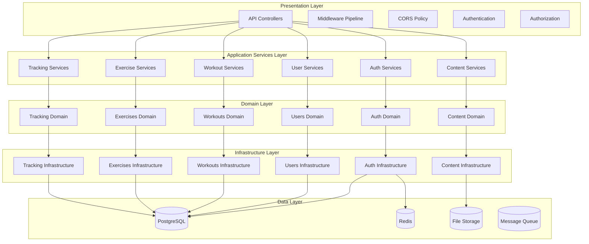
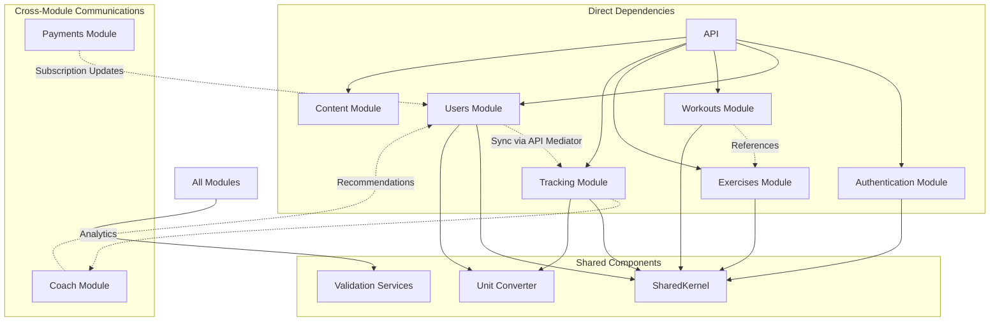
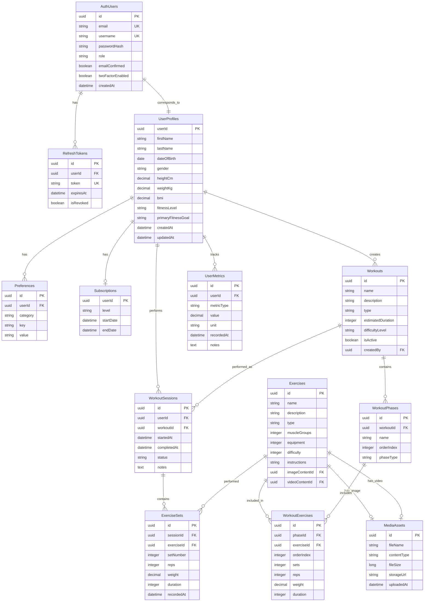
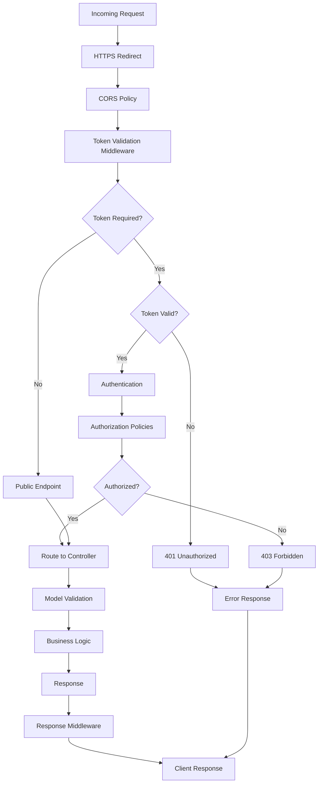
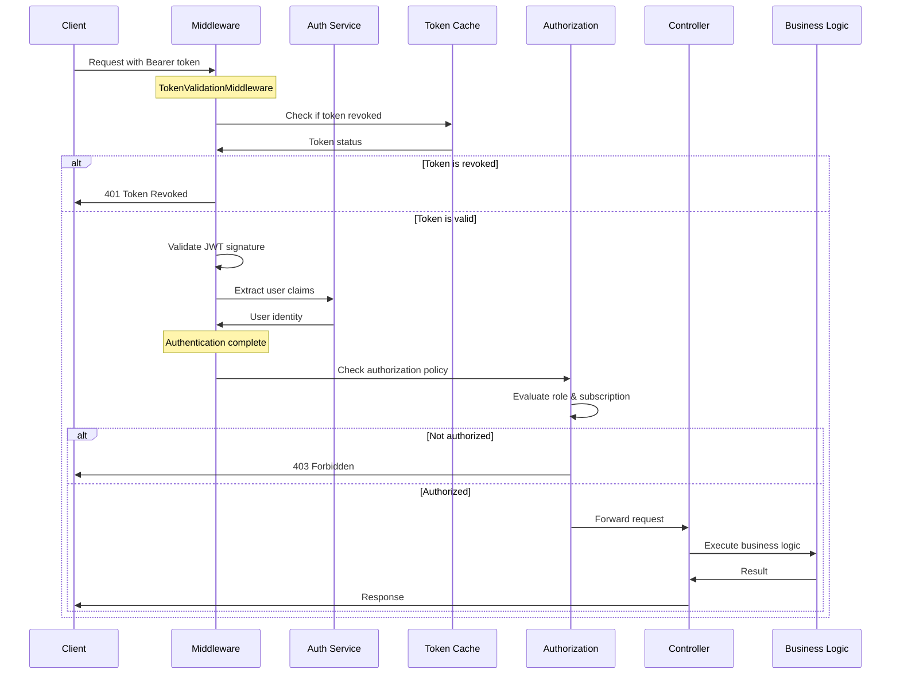
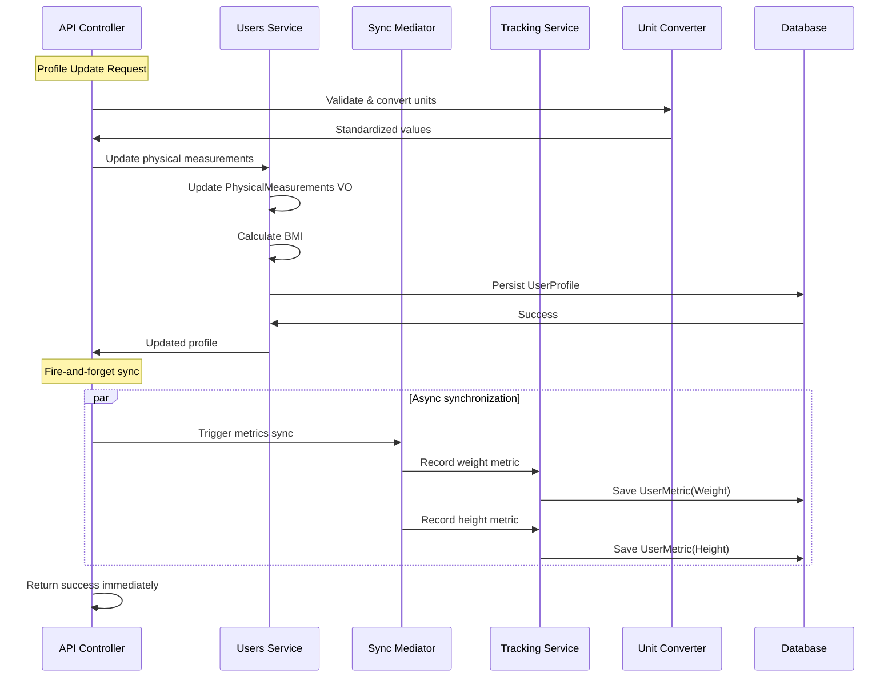
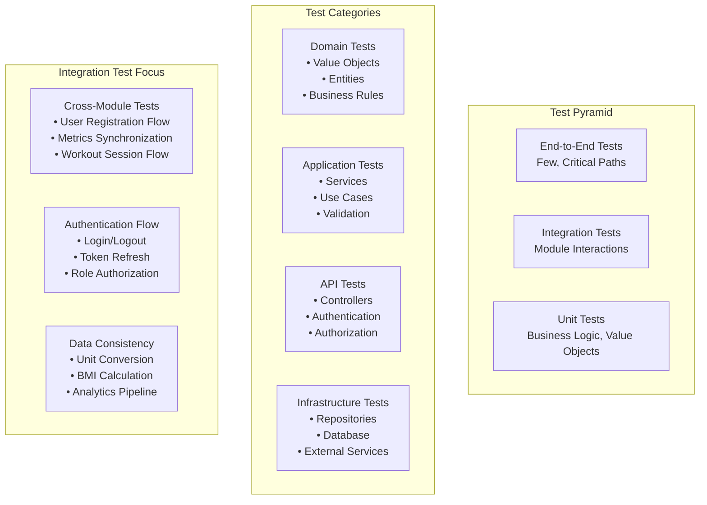
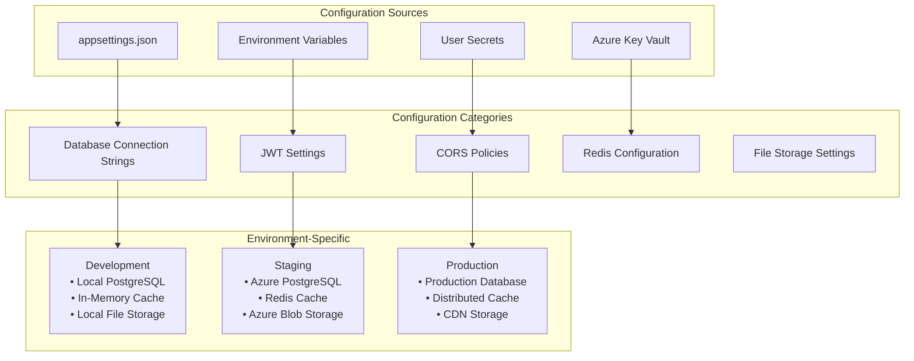
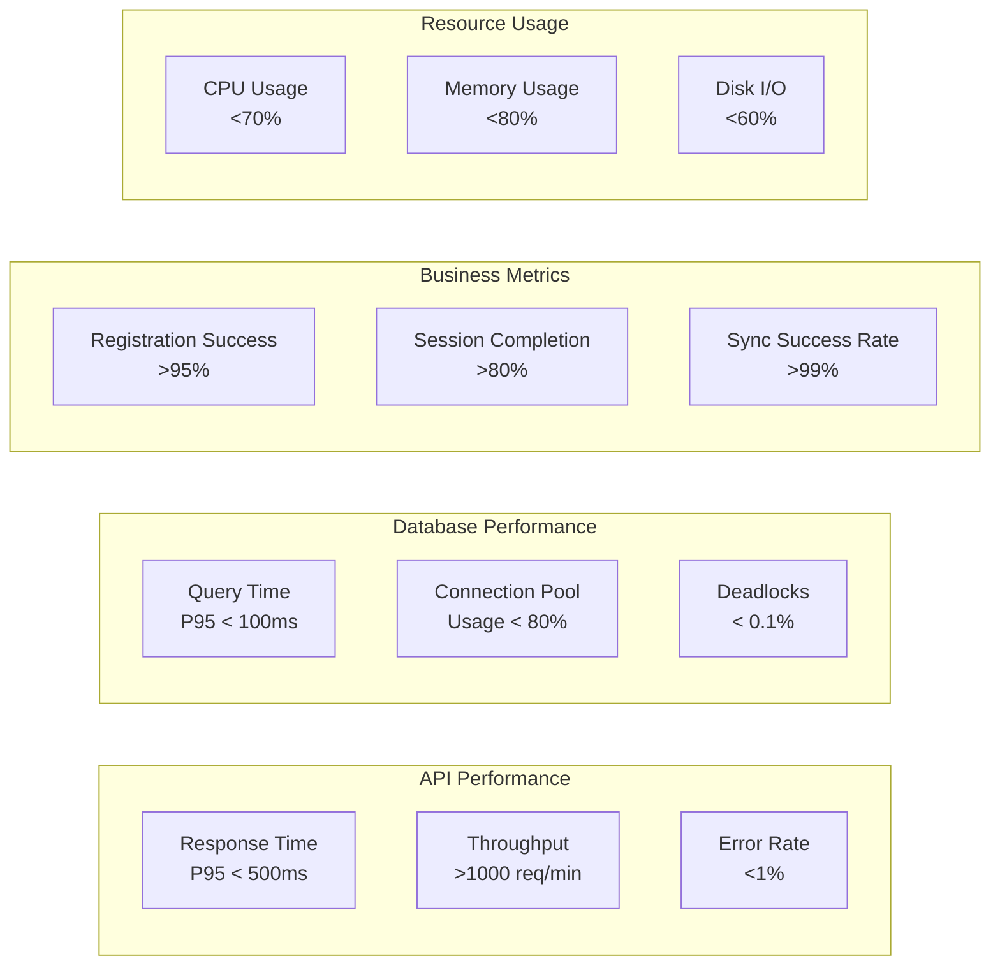

# Architecture Technique Détaillée - FitnessApp

## 🏗️ Architecture en Couches

### Vue d'Ensemble des Couches

## 🔄 Flux de Données et Communications Inter-Modules

### Communication Patterns

## 📊 Architecture des Données

### Modèle de Données Cross-Module

## 🛠️ Middleware Pipeline

### Request Processing Pipeline

## 🔐 Security Architecture

### Authentication & Authorization Flow

## 📈 Data Synchronization Patterns

### User Metrics Synchronization

## 🧪 Testing Architecture

### Test Pyramid Structure

## 🔧 Configuration & Deployment

### Environment Configuration

## 📊 Performance Monitoring Points

### Critical Performance Metrics

Cette architecture technique détaillée fournit :

1. **Vue en couches** : Séparation claire des responsabilités
2. **Communications inter-modules** : Patterns de communication et dépendances
3. **Modèle de données** : Relations entre entités cross-module
4. **Pipeline middleware** : Traitement des requêtes et sécurité
5. **Synchronisation de données** : Patterns async et cohérence
6. **Architecture de tests** : Structure et focus des tests
7. **Configuration** : Gestion des environnements
8. **Monitoring** : Métriques critiques à surveiller

Cette documentation technique complète le guide des parcours utilisateurs pour une compréhension holistique de l'application avant l'écriture des tests d'intégration.
