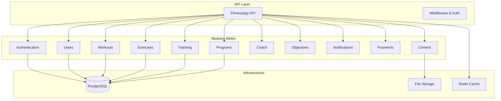
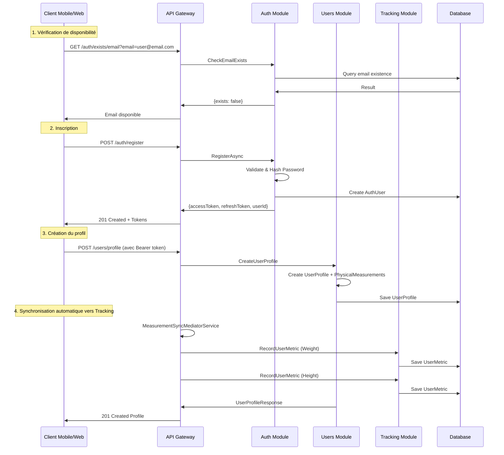
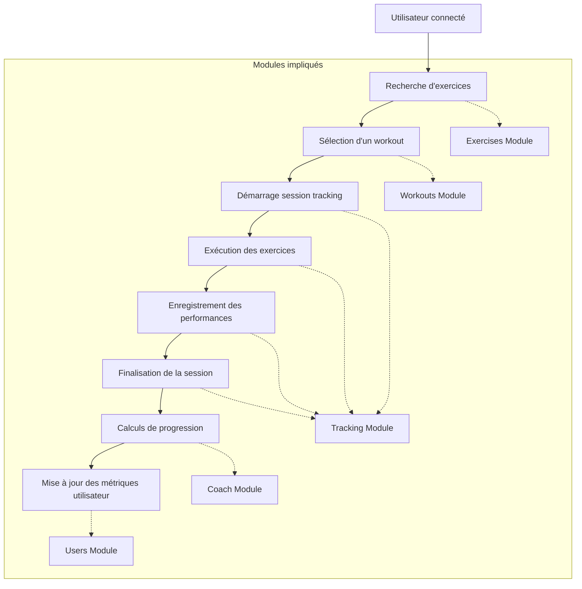
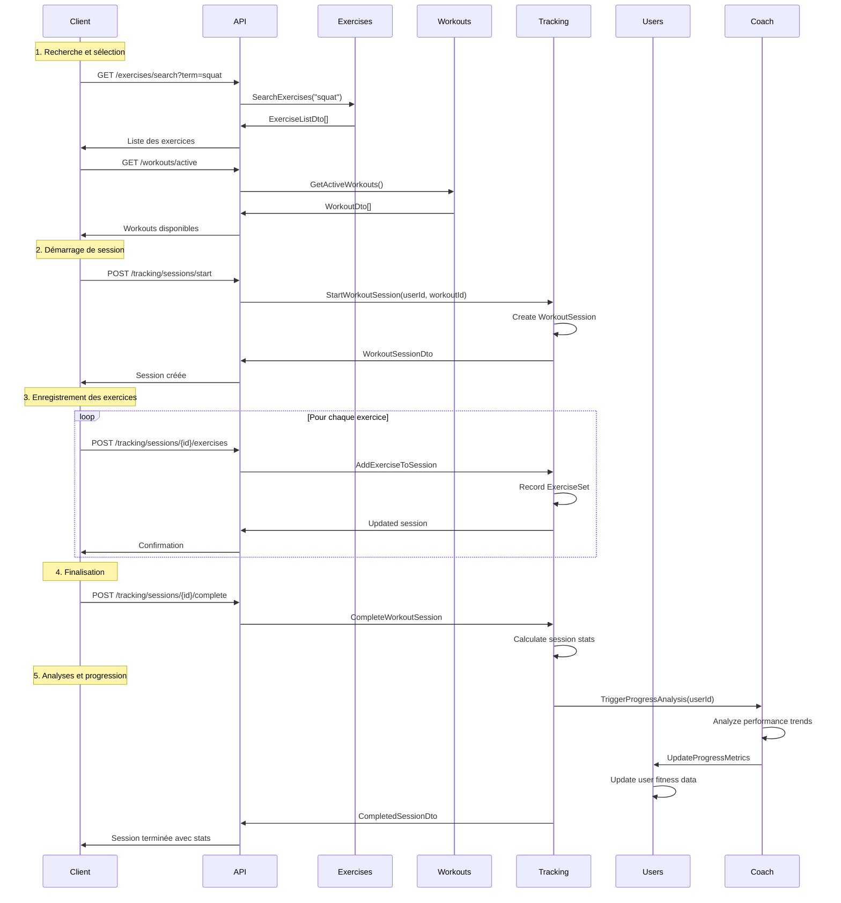
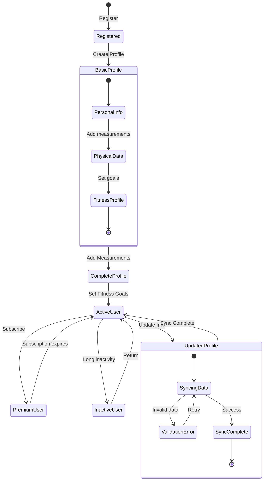
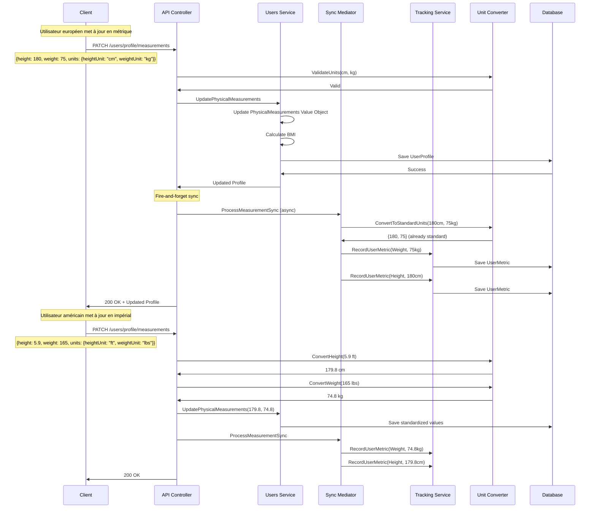
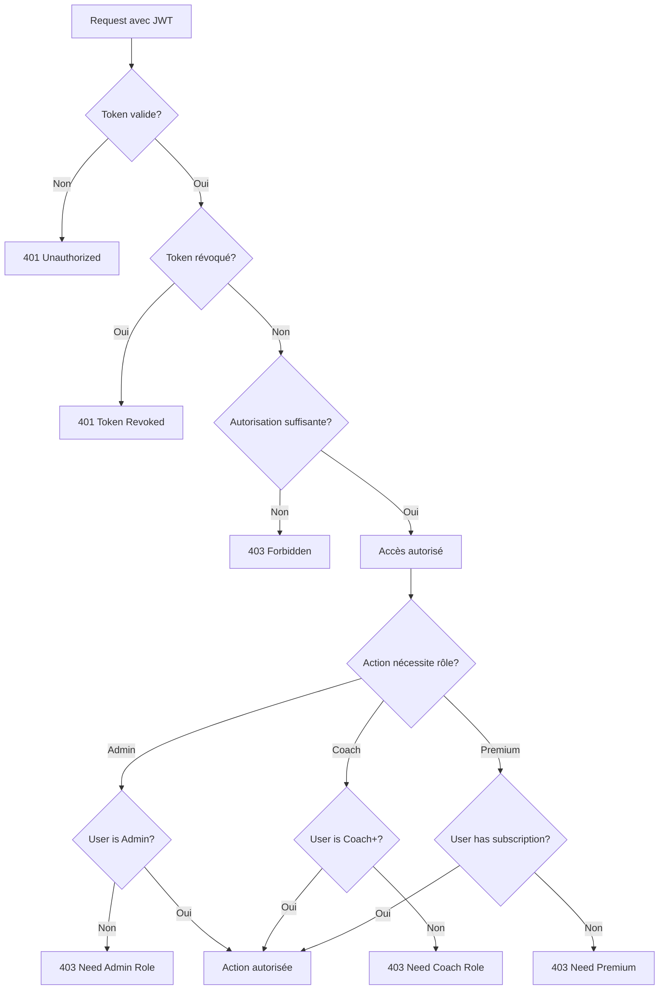
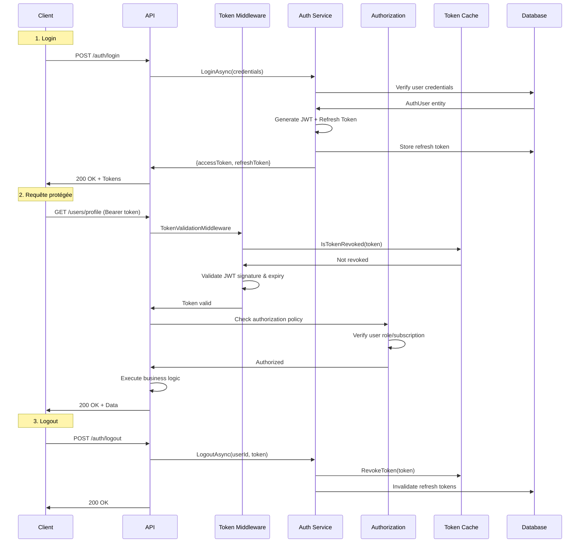
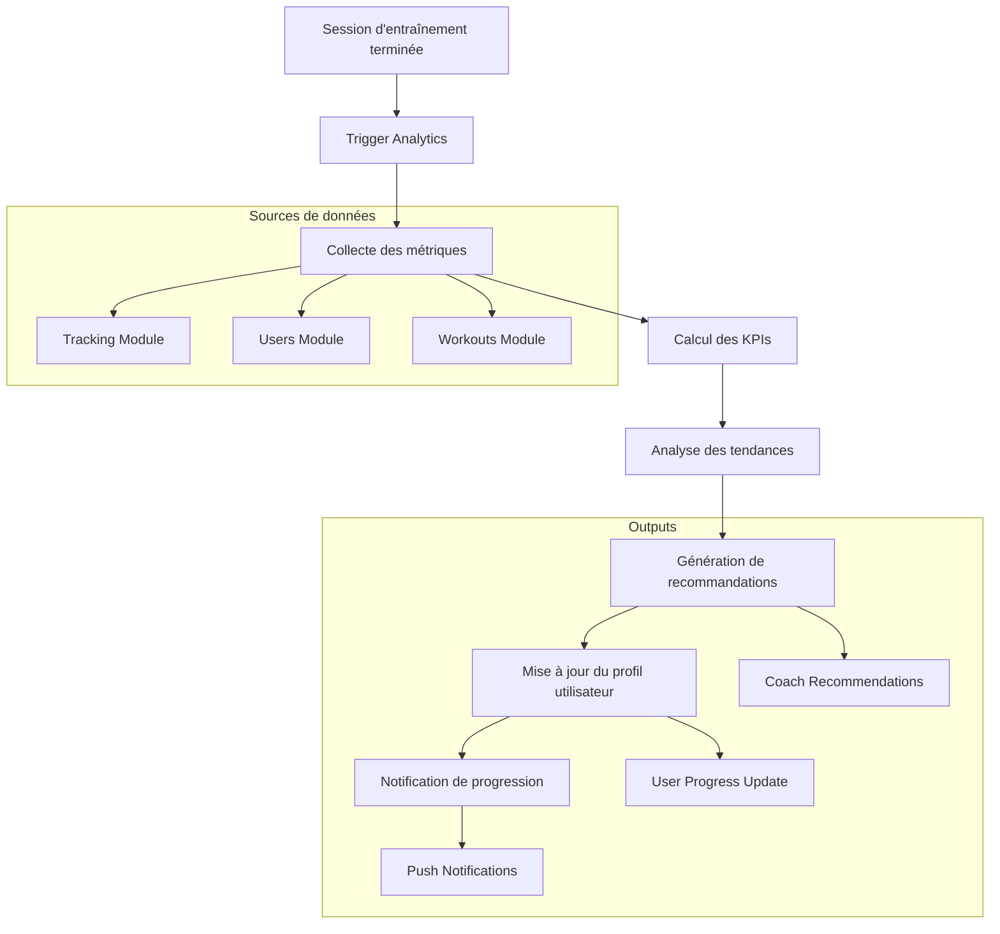
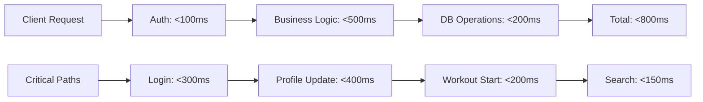

# Architecture et Parcours Utilisateurs - FitnessApp

## 🎯 Vue d'ensemble

Cette documentation présente l'architecture globale de FitnessApp et les parcours utilisateurs pour faciliter l'écriture de tests d'intégration pertinents.

## 📐 Architecture Modulaire Globale

## 🚀 Parcours Utilisateur : Inscription et Premier Profil

### Diagramme de Séquence

### Points de Test d'Intégration

1. **Validation Email** : Tester les regex et formats email
2. **Sécurité Mot de Passe** : Vérifier les règles de complexité
3. **Cohérence des Tokens** : Valider JWT et refresh tokens
4. **Synchronisation Cross-Module** : Vérifier que les métriques sont créées dans Tracking
5. **Gestion des Erreurs** : Tester rollback en cas d'échec partiel

## 🏃‍♀️ Parcours Utilisateur : Session d'Entraînement Complète

### Diagramme de Flux

### Diagramme de Séquence Détaillé

### Points de Test d'Intégration

1. **Recherche Cross-Module** : Vérifier les requêtes entre Exercises/Workouts
2. **State Management** : Tester la cohérence d'état des sessions
3. **Calculs de Performance** : Valider les métriques calculées
4. **Synchronisation Modules** : Coach → Users pour progression
5. **Gestion des Timeouts** : Sessions abandonnées

## 👤 Parcours Utilisateur : Gestion Complète du Profil

### Diagramme de Flux États

### Diagramme de Séquence : Mise à jour Profil avec Multi-Unités

### Points de Test d'Intégration

1. **Conversion d'Unités** : Tester toutes les combinaisons (cm/ft/in, kg/lbs)
2. **Cohérence des Données** : Vérifier BMI recalculé automatiquement
3. **Synchronisation Asynchrone** : Valider le fire-and-forget vers Tracking
4. **Validation Cross-Module** : Règles business appliquées partout
5. **Gestion des Préférences** : Stockage et récupération des unités favorites

## 🔐 Parcours Authentification et Autorisation

### Diagramme de Flux Sécurité

### Diagramme de Séquence : Login et Autorisation

### Points de Test d'Intégration

1. **Cycle Complet d'Auth** : Login → Request → Logout
2. **Gestion des Tokens** : Validation, révocation, refresh
3. **Politiques d'Autorisation** : Rôles et niveaux d'abonnement
4. **Sécurité Cross-Controller** : Cohérence entre endpoints
5. **Token Expiry & Refresh** : Renouvellement automatique

## 📊 Parcours Analytics et Coaching

### Diagramme de Flux Analytics

## 🧪 Matrice des Tests d'Intégration Critiques

### Parcours Cross-Module

| Scénario                  | Modules Impliqués                       | Points de Validation                            |
| ------------------------- | --------------------------------------- | ----------------------------------------------- |
| **Inscription Complète**  | AUTH → USERS → TRACKING                 | Token validity, Profile creation, Metrics sync  |
| **Session Workout**       | EXERCISES → WORKOUTS → TRACKING → COACH | Data flow, State consistency, Analytics trigger |
| **Mise à jour Profil**    | USERS → TRACKING + Unit conversion      | Data synchronization, Unit conversion accuracy  |
| **Progression Analytics** | TRACKING → COACH → USERS                | Calculation accuracy, Profile updates           |
| **Gestion Abonnements**   | USERS → PAYMENTS → Authorization        | Payment processing, Access control updates      |

### Scénarios de Robustesse

| Test Case                      | Description                                       | Expected Behavior                              |
| ------------------------------ | ------------------------------------------------- | ---------------------------------------------- |
| **Sync Failure**               | Tracking module unavailable during profile update | Profile update succeeds, sync logged for retry |
| **Token Expiry**               | JWT expires during long session                   | Graceful refresh or re-auth prompt             |
| **Database Timeout**           | DB connection issues                              | Proper error handling, no data corruption      |
| **Unit Conversion Edge Cases** | Invalid or extreme unit values                    | Validation errors, no corrupt data stored      |
| **Concurrent Updates**         | Multiple clients updating same user data          | Last-write-wins or conflict resolution         |

## 📈 Métriques de Performance à Surveiller

### API Response Times

Cette documentation fournit une base solide pour créer des tests d'intégration pertinents en couvrant :

- Les parcours utilisateurs critiques
- Les interactions cross-module
- Les points de validation essentiels
- Les scénarios de robustesse
- Les métriques de performance

Les diagrammes facilitent la compréhension des flux de données et des dépendances entre composants, permettant de cibler les tests là où ils auront le plus d'impact.
